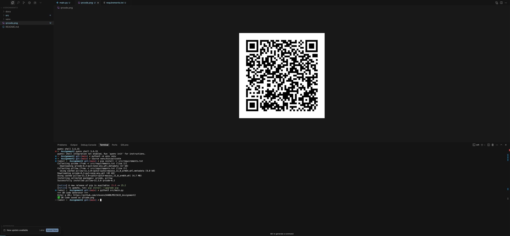

# QR Code Generator - MSCS633 Assignment 2

## Overview

This project implements a QR Code generator application using Python. QR Codes (Quick Response Codes) were invented in 1994 by the Japanese company Denso Wave as a two-dimensional way to represent information in machine-readable form.

## Assignment Description

Construct a QR code generator at Biox Systems using Python that generates a QR code when you input a URL address.

## Technical Requirements

### Environment Setup

1. **Install Python** (3.7+ recommended)
2. **Install the qrcode library** and dependencies
3. **Visual Studio Code** (suggested IDE)
4. **GitHub account** for code sharing

### Dependencies

The project requires the following Python packages:
- `qrcode` - For QR code generation
- `pillow` - For image processing and saving

## Installation & Setup

1. **Clone the repository:**
   ```bash
   git clone <your-github-repo-url>
   cd Assignment2
   ```

2. **Create a virtual environment (recommended):**
   ```bash
   python -m venv venv
   source venv/bin/activate  # On Windows: venv\Scripts\activate
   ```

3. **Install dependencies:**
   ```bash
   pip install -r src/requirements.txt
   ```

## Usage

1. **Navigate to the source directory:**
   ```bash
   cd src
   ```

2. **Run the application:**
   ```bash
   python main.py
   ```

3. **Enter a URL when prompted:**
   ```
   === QR Code Generator ===
   Enter a URL: https://www.example.com
   ✅ QR Code saved as qrcode.png
   ```

4. **Find your generated QR code:**
   The QR code will be saved as `qrcode.png` in the same directory.

## Project Structure

```
Assignment2/
├── README.md                 # This file
├── docs/                    # Documentation and screenshots
│   ├── qrcode.png          # Sample QR code output
│   └── ScriptRunScreenshot.png  # Application screenshot
└── src/                    # Source code
    ├── main.py            # Main application file
    └── requirements.txt   # Python dependencies
```

## Code Documentation

### Main Functions

#### `generate_qr(url: str, filename: str = "qrcode.png") -> None`

Generates a QR code from the given URL and saves it as an image.

**Parameters:**
- `url` (str): The URL to encode in the QR code
- `filename` (str): The output image filename (default: "qrcode.png")

**QR Code Configuration:**
- **Version**: 1 (small size, auto-adjusts based on data)
- **Error Correction**: High (ERROR_CORRECT_H) - can recover from up to 30% damage
- **Box Size**: 10 pixels per module
- **Border**: 4 modules thick (minimum recommended)
- **Colors**: Black QR code on white background

## Sample Output

The application generates a QR code that can be scanned by any QR code reader to access the provided URL.


## Screenshots



## Deliverables

- ✅ **Python source code** (`src/main.py`)
- ✅ **Manifest file** (`src/requirements.txt`)
- ✅ **Screenshot** of application output (`docs/ScriptRunScreenshot.png`)
- ✅ **GitHub repository** with code sharing
- ✅ **Coding best practices** and comprehensive comments

## Author

**Steven Sisjayawan**  
MSCS633 - Assignment 2

## GitHub Repository

[Link to GitHub Repository](https://github.com/yourusername/Assignment2)